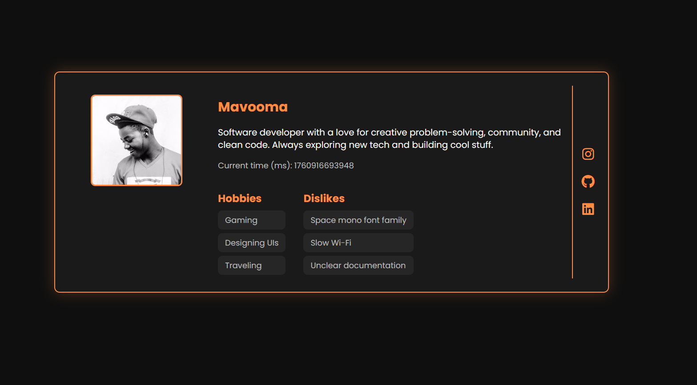

---

markdown
# 🪪 Profile Card Component

A small, accessible, and responsive **Profile Card** built with **semantic HTML**, **modern CSS**, and **vanilla JavaScript**.  
It includes all required data-testid attributes for automated testing and adheres to accessibility and responsive design principles.

---

## ✨ Features

- ✅ Semantic, accessible HTML5 structure (`<article>`, `<header>`, `<figure>`, `<nav>`, `<section>`, etc.)
- 🎨 Bright, modern design — dark background, light text, and orange highlights
- 🖼️ Avatar image (square-style)
- 📜 User name, biography, current time in milliseconds
- 🌐 Vertical social media icon links (Twitter, GitHub, LinkedIn)
- 💡 Distinct sections for hobbies and dislikes, displayed side by side
- 📱 Responsive layout for mobile, tablet, and desktop
- ⏳ Simple loading animation
- 🥚 Easter egg — subtle hidden element for those who look closely 😉

---

## 🧱 Project Structure


/
├── index.html          # Main HTML file with semantic markup and data-testids
├── style.css           # Styling with CSS Grid / Flexbox and media queries
├── script.js           # Handles time display and optional dynamic behavior
└── README.md           # Project documentation

`

---

## 🧩 Data Test IDs (for automated testing)

| Element | data-testid |
|----------|--------------|
| Profile Card Container | `test-profile-card` |
| User Name | `test-user-name` |
| Biography | `test-user-bio` |
| Current Time (ms) | `test-user-time` |
| Avatar Image | `test-user-avatar` |
| Social Links Container | `test-user-social-links` |
| Twitter Link | `test-user-social-twitter` |
| GitHub Link | `test-user-social-github` |
| LinkedIn Link | `test-user-social-linkedin` |
| Hobbies List | `test-user-hobbies` |
| Dislikes List | `test-user-dislikes` |

---

## 🖋️ Semantic Markup Highlights

- `<article>` wraps the profile card (`data-testid="test-profile-card"`)
- `<header>` contains the name and avatar
- `<p>` for user bio
- `<nav>` for social links
- `<section>` for hobbies and dislikes (each with `<ul><li>`)
- All links are keyboard-focusable and accessible

---

## 🧠 Behavior

- Displays current time using `Date.now()` in milliseconds
- Avatar supports both remote URLs and uploaded images
- Social links open in a new tab with `target="_blank"` and `rel="noopener noreferrer"`
- Fully keyboard-navigable (with visible focus states)
- Optional periodic update for the time field

---

## 💻 Running the Project

Simply open `index.html` in your browser — no build tools required.

```bash
# clone the repo
git clone https://github.com/<mavooma>/profile-card.git
cd profile-card

# open in browser
open index.html
`

---

## 🧩 Easter Egg

There's a subtle hidden touch inside the card styling or DOM that only appears on **hovering the avatar** 😉.
(It's harmless but fun to discover.)

---

## 🧰 Technologies Used

* **HTML5** (semantic structure)
* **CSS3** (Flexbox, Grid, animations, transitions)
* **Vanilla JavaScript** (DOM manipulation, time handling)
* **Font Awesome 6** for icons

---

## 📸 Screenshot

*(Optional — you can add a screenshot later)*

